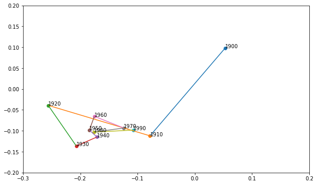
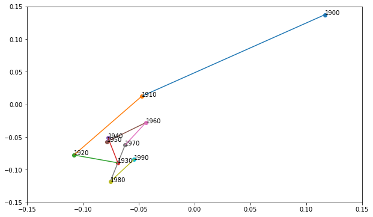
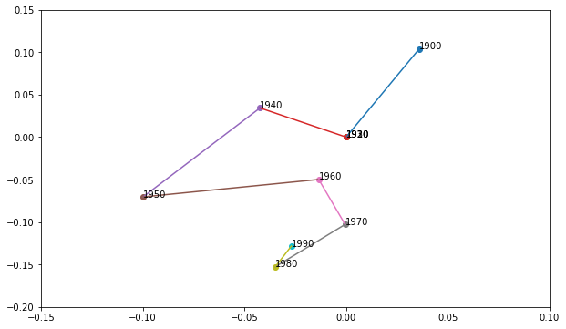

# CSC2611-Assignment

## Implementation
All the findings are replicated in the notebook "main.ipynb", except some findings related to the previous exercise can be found in "exercise.ipynb".
## Synchronic word embedding
### Step 3

The cosine distance between each pair of word embeddings you have extracted, and report the Pearson correlation between word2vec-based and human similarities is -0.7721, with the two-tailed p-value=5.0911e-14. 
The value of the Pearson correlations I got from the earlier exercise is quite small. (See the table below) This means there might be no consistency between the similarities got from the models and humans. However, the pearson correlation between word2vec-based and human similarities is quite close to 1, which indicates that word2vec is more precise representation of words compared to the LSA models.

Model|Pearson correlation
:-|:-:
Word2vec|-0.7721
M1|-0.0549
M1+|-0.0031
$M2_{10}$|-0.1959
$M2_{100}$|-0.2923
$M2_{300}$|-0.2711

### Step 4

I first generated the test set consisting of words shared by the two different models, which can found in the tests/ directory ("word-test-semantic.txt" and "word-text-syntactic.txt"). I then performed analogy test on the test sets with two different models. We can see from the Table above that the accuracy of Word2vec is much higher than that of LSA. I mannually checked the results of LSA and found they rarely hit any answer. Therefore, we might conclude that Word2vec performs much better than LSA on the analogical reasoning task (at least on the test set provided).

Test set|Word2vec|LSA (300 dimensions)
:-:|:-:|:-:
Semantic|0.900|0.676
Syntactic|0.000|0.001

### Step 5

We can manipulate the dimension of the vectors to improve the existing set of vector-based models in capturing word similarities in general. It is mentioned in the Word2vec paper[4] that the "most crucial decisions that affect the performance" are the choice of the model architecture, the size of the vectors, the subsampling rate, and the size of the training window. Also we can see from our experiment with LSA that $M2_{100}$ performs best among all the models, which indicates that dimensions can affect the accuracy and it is not necessarily a positive or negative correlation.

## Diachronic word embedding
### Step 2

To measure the semantic changes of word, I think the key here is to find a metric to measure the distance between the word's vector represenation in 1900 ($\bf{w}_{1900}$) and 1990($\bf{w}_{1990}$).  According to [1], I selected 2 of the metrics they proposed: cosine distance and Pearson correlation. That is, using the cosine distance or Pearson correlation to represent the distance between the 1900 and 1990's word vectors. I also found another metric in [2] that use the **local neighborhood measure**. This measure is based on the intuition that only a word’s nearest semantic neighbors are relevant. They obtained a set of k nearest neighbours of a word in 2 decades and generated a "second-similarity" vector out of the cosine similarities of the neighbour words. The distance between 1900 and 1990 is finally calculated as the distance between the second-similarity vectors.

The top 20 most and least changing words are listed below.

Metric|20 most|20 least
:-|:-|:-
Cosine distance|'programs', 'objectives', 'computer', 'radio', 'sector', 'goals', 'approach', 'van', 'shri', 'media', 'impact', 'perspective', 'patterns', 'berkeley', 'shift', 'film', 'assessment', 'stanford', 'challenge', 'therapy'|'week', 'feet', 'september', 'god', 'december', 'daughter', 'months', 'century', 'january', 'increase', 'october', 'years', 'february', 'november', 'june', 'april', 'techniques', 'skills', 'mcgraw', 'ml'|
Pearson Correlation|'programs', 'objectives', 'computer', 'approach', 'impact', 'signal', 'file', 'bar', 'drive', 'johnson', 'reserve', 'intelligence', 'agency', 'ray', 'club', 'publishing', 'mode', 'emphasis', 'row', 'grand'|'miles', 'payment', 'evening', 'week', 'door', 'feet', 'september', 'god', 'december', 'daughter', 'months', 'century', 'january', 'increase', 'october', 'february', 'years', 'november', 'june', 'april'
Local neighborhood|'objectives', 'radio', 'approach', 'computer', 'sector', 'impact', 'film', 'signal', 'programs', 'assessment', 'mcgraw', 'skills', 'focus', 'ml', 'techniques', 'media', 'patterns', 'models', 'framework', 'goals'|'shore', 'evening', 'georgia', 'september', 'father', 'april', 'wife', 'autumn', 'night', 'ohio', 'june', 'mother', 'snow', 'january', 'iowa', 'summer', 'december', 'afternoon', 'coast', 'months'

Intercorrelations among the 3 metrics (Pearson correlations)
--|Cosine distance|Pearson correlation|Local neighborhood
:-|:-:|:-:|:-:
Cosine distance|--|0.0579|0.2040
Pearson correlation|0.0579|--|0.3465
Local neighborhood|0.2040|0.3465|--

## Step 3

I searched for some papers about detecting semantic changes and focused on their evaluation methods, but found that most of them requires a ground-truth dataset, i.e. a dataset of the known words whose meanings has changed. However, we do not have such dataset here in this assignment. I had no choice but directly reuse the reference data set D of 20 words in [3]. I filtered out 6 words which also exists in out assignment dataset and used it as my reference dataset and used the Precision@k method to evaluate to accuracy. Unfortunately, none of the top20 most changed words contain any of the 6 words here, so I had no choice but to expand the size of the top-most set to 200 and calculated the Precision@k value for each of the method above. The result turns out to be that cosine distance is best metric here, which contradicts my expectation that local neighborhood should be the best.

$k$|Cosine distance|Pearson Correlation|Local neighborhood
:-:|:-:|:-:|:-:
1|0.005|0|0
2|0.005|0|0
3|0.005|0|0
4|0.01|0|0.005
5|0.01|0|0.005
6|0.01|0|0.005

We can see that the precision values here are all very small, so it might not be a best metric here, but it is the best metric I can think of. I will use cosine distance temporarily for the following steps.

## Step 4

The top 3 words are: 'programs', 'objectives', 'computer'.
As to the way of detecting the point(s) of semantic change, I output all the distances between each two decades. The one(s) with significantly larger distances (>0.5) are considered as the change point(s). I know this is not a rigor definition, but since we only have 8 distances here, I tried to make it as simple as possible. 

'programs':
Distances (in the order of time): **0.7804**,**0.6257**,0.3559,0.2146,0.2694,0.2218,0.2255,0.2267,0.2254
Change points: 1910, 1920
Visualization: 

'objectives':
Distances (in the order of time): **0.7850**,**0.7515**,0.2387,0.2239,0.2407,0.2239,0.2146,0.2175,0.2426
Change points: 1910, 1920
Visualization: 

'computer':
Distances (in the order of time):0.0,0.0,0.0,0.0,**0.6495**,0.3183,0.2461,0.249,0.2182
Change points: 1950
Visualization: 

## Refercences

[1] Jatowt A, Campos R, Bhowmick S S, et al. Every word has its history: Interactive exploration and visualization of word sense evolution[C]//Proceedings of the 27th ACM International Conference on Information and Knowledge Management. 2018: 1899-1902.
[2] Hamilton W L, Leskovec J, Jurafsky D. Cultural shift or linguistic drift? comparing two computational measures of semantic change[C]//Proceedings of the Conference on Empirical Methods in Natural Language Processing. Conference on Empirical Methods in Natural Language Processing. NIH Public Access, 2016, 2016: 2116.
[3] Kulkarni V, Al-Rfou R, Perozzi B, et al. Statistically significant detection of linguistic change[C]//Proceedings of the 24th international conference on world wide web. 2015: 625-635.
[4] Mikolov T, Sutskever I, Chen K, et al. Distributed representations of words and phrases and their compositionality[J]. Advances in neural information processing systems, 2013, 26.